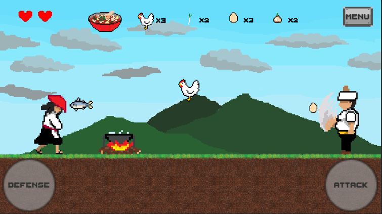
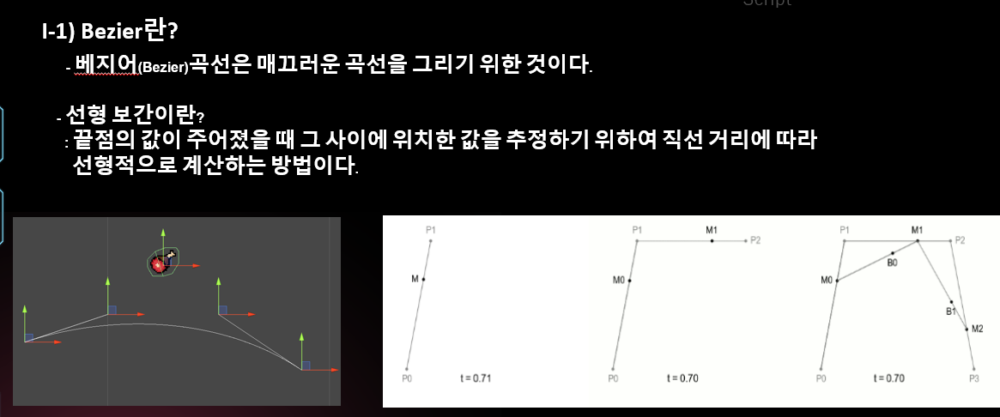
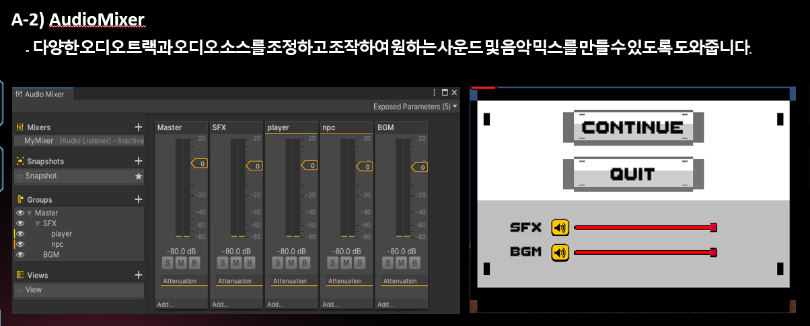
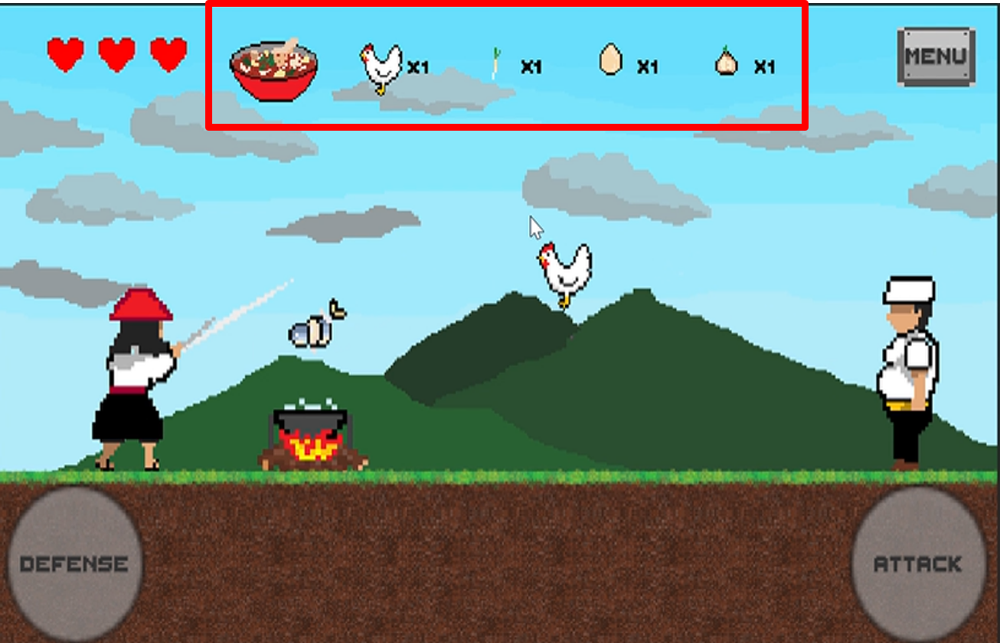
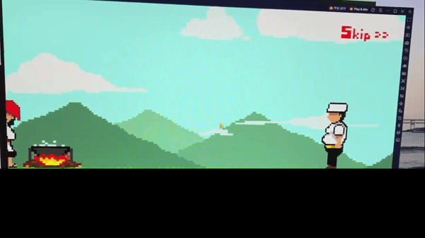

# 프로젝트명
 고기싸무라이

## 게임 소개
 * 장르 : 2D 아케이드
 * 플랫폼 : 모바일 구글 플레이스토어
 * 소개
   - 최고의 미식가(npc)에게 주인공(pc)의 요리는 최악의 혹평을 받았다. 충격을 받은 주인공(pc)는 산속에 들어가 사무라이를 연상케 하는 방식으로 요리훈련을 한다.
     그로부터 10년 뒤 드디어 하산한 주인공은 마을로 돌아가던 중 여행중이던 최고의 미식가(npc)를 만나게 된다.
     주인공을 알아본 미식가가 짐꾸러미 속 많은 재료들을 보여주며 그를 도발하자, 복수의 식칼을 갈아온 주인공은 미식가에게 재료를 던지라고 말하며, 그의 10년의 노력을 건 승부가 시작된다.
     
## 개발 환경

## 게임화면

## 내가 구현한 기능
 * 레시피의 재료가 날아오는 궤적(베지어 곡선)
 * 음량(BGM, 배경소리) 조절기능
 * 레시피의 완성도 구현
 * UI적인 인터렉션 요소(레시피의 완성도를 보여준다거나 레시피가 나타났을 때 효과 등)을 구현

## 레시피의 재료가 날아오는 궤적(베지어 곡선) 기능

## 음량(BGM, 배경소리) 조절 기능

## 레시피 완성도 구현

## UI적인 인터렉션 요소(레시피의 완성도를 보여준다거나 레시피가 나타났을 때 효과 등)을 구현

